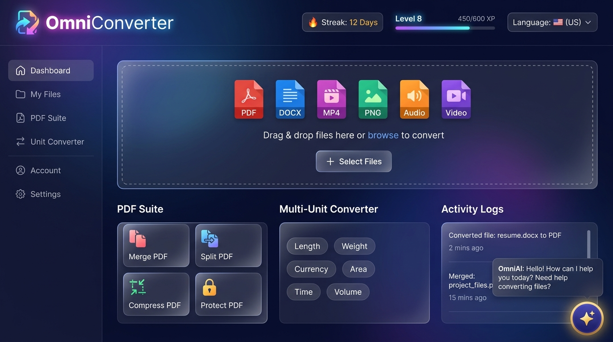
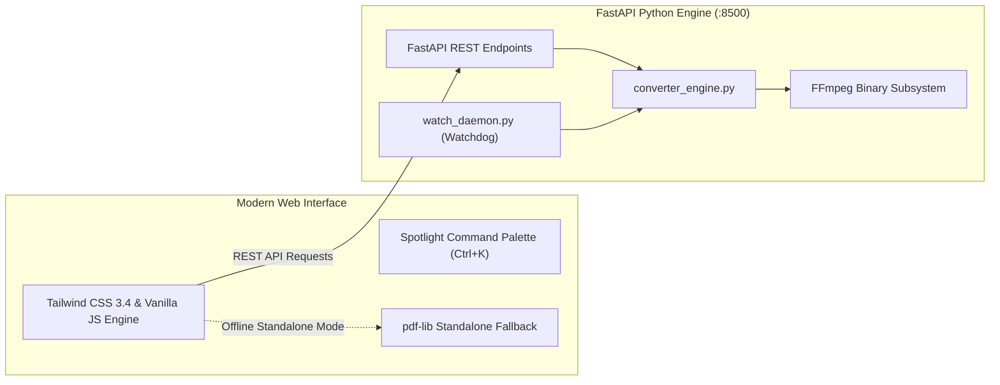

<div align="center">

  

  <p align="center">
    <b>⚡ High-Performance Universal Media Engine • 📄 Pro PDF Suite • 🔒 100% Privacy-First & Offline Capable</b>
  </p>

  <p align="center">
    <a href="https://github.com/Winter-Cream/OmniConverter/actions/workflows/ci.yml"></a>
    <a href="https://winter-cream.github.io/OmniConverter/"></a>
    <a href="https://github.com/Winter-Cream/OmniConverter/releases"></a>
    <a href="https://www.python.org"></a>
    <a href="https://fastapi.tiangolo.com"></a>
    <a href="https://opensource.org/licenses/MIT"></a>
  </p>

  <p align="center">
    <a href="https://winter-cream.github.io/OmniConverter/"><b>🌐 Try Live Demo</b></a> •
    <a href="#-quick-start"><b>🚀 Quick Start</b></a> •
    <a href="#-core-capabilities"><b>✨ Features</b></a> •
    <a href="#-supported-formats-matrix"><b>📑 50+ Formats</b></a> •
    <a href="#-pdf-power-suite"><b>📄 PDF Suite</b></a> •
    <a href="#-watch-folder-daemon"><b>⚡ Watch Folder</b></a> •
    <a href="#-architecture"><b>🏗️ Architecture</b></a> •
    <a href="#-rest-api-reference"><b>🔌 API</b></a>
  </p>

  <br>

  <div align="center">
    <a href="https://winter-cream.github.io/OmniConverter/">
      
    </a>
    <p><i>✨ Interactive Dashboard Preview with File Converter Dropzone, PDF Suite, Multi-Unit Engine & Floating OmniAI Assistant</i></p>
  </div>

</div>

---

## 💡 Why OmniConverter?

Cloud-based conversion tools often subject users to **paywalls, restrictive 15–25MB file caps, tedious upload waits**, and **severe privacy concerns** by storing sensitive documents on third-party servers.

**OmniConverter** was engineered to solve this. It is a completely free, open-source, local-first powerhouse that brings industrial-grade file processing directly to your machine or browser.

```
┌─────────────────────────────────────────────────────────────────────────────────┐
│                                                                                 │
│   🔒 100% Local & Privacy-First    ⚡ 50+ Formats Supported                      │
│   📄 Full 6-Tool PDF Power Suite   📁 Automated Watch Folder Daemon             │
│   🌓 Adaptive Dark & Light Modes   🌐 Standalone Offline Browser Execution     │
│   🧮 100+ Multi-Unit Converter     ⚡ Snappy 0.14s Fluid Micro-Animations       │
│                                                                                 │
└─────────────────────────────────────────────────────────────────────────────────┘
```

---

## ⚖️ Feature Comparison

| Feature Capability | ⚡ OmniConverter | CloudConvert / Smallpdf | Adobe Acrobat Pro |
| :--- | :---: | :---: | :---: |
| **Pricing** | **100% Free & Open Source** | Freemium ($9–$99/month) | $239/year Subscription |
| **File Size Limit** | **Unlimited** (Hardware Bound) | 25 MB Limit | Account Restricted |
| **Data Privacy** | **100% Local & Self-Hosted** | Files uploaded to cloud | Files synced to Adobe Cloud |
| **Offline Browser Mode** | **Yes (`pdf-lib` Native)** | ❌ No (Requires Internet) | ❌ Desktop App Only |
| **Watch Folder Automation** | **Yes (`watch_daemon.py`)** | ❌ No | ❌ No |
| **Batch ZIP Processing** | **Yes (One-Click Archive)** | Limited | Limited |
| **Command Palette (`Ctrl+K`)** | **Yes (Under 100ms Search)** | ❌ No | ❌ No |
| **Custom Light & Dark Themes** | **Curated Stripe/Linear Style** | Standard / None | Standard |
| **Gamification & Daily Streaks**| **XP Levels, Badges & Quests**| ❌ No | ❌ No |

---

## ✨ Core Capabilities

### 📁 1. Universal Batch File Converter
- Convert Documents, Images, Audio, Video, and Data formats seamlessly.
- Granular controls: Video quality presets (1080p, 720p, 480p), audio track stripping, custom bitrates (320kbps, 256kbps), image dimensional resizing with aspect ratio locking, and compression quality sliders.
- Download converted files individually or bundle entire batch jobs into a compressed **ZIP archive**.

### 📄 2. Pro PDF Power Suite
- **Merge PDFs**: Combine multiple disparate PDF documents into a unified output in seconds.
- **Split & Extract**: Extract specific page intervals (`1-5, 8, odd, even`) into a single PDF or individual pages inside a ZIP.
- **Compress PDF**: Reduce file weight by up to **85%** without sacrificing legibility (`Low`, `Medium`, `High` presets).
- **Encrypt (Protect)**: Lock sensitive PDFs with standard password-protected AES encryption.
- **Decrypt (Unlock)**: Authenticate and strip password restrictions from protected documents.
- **Rotate Pages**: Fix orientations with 90°, 180°, or 270° clockwise adjustments.

### ⚡ 3. Watch Folder Automation Daemon
- Set up a designated input folder (`C:\OmniWatch\Input` or `./watch_input`).
- Any file dropped into the folder is automatically processed and exported to `./watch_output` in the background with zero user intervention.

### 🧮 4. Multi-Unit Converter Lab
- Exhaustive converter covering **10 categories and 100+ units**: Data Storage, Length/Distance, Weight/Mass, Speed, Temperature, Area, Volume, Time, Energy, and Pressure.
- Instant real-time calculation with bidirectional live sync.

### 🔍 5. Spotlight Command Palette (`Ctrl + K` / `Cmd + K`)
- Press **Ctrl + K** anywhere to instantly trigger a keyboard-driven command modal.
- Search and jump to any converter tool, PDF operation, or unit calculator in under **100ms**.

### 🎨 6. Curated Adaptive Themes & Fluid UX
- **Light Theme**: Clean, high-contrast Stripe/Linear-inspired surface palette (`#ffffff` layered cards, deep `#0f172a` ink text, custom SVG select controls).
- **Dark Theme**: Deep navy space glassmorphism (`#090d16` canvas with frosted-glass panels).
- **Fluid Animation Engine**: Snappy `0.14s` cubic-bezier easing curves, responsive tactile button feedback, and audio sound FX synthesizer.

### 🤖 7. OmniAI Floating Assistant (Gemini, OpenAI, Grok, Claude)
- Floating interactive chatbot hovering at the bottom-right corner.
- Provides immediate guidance on merging/splitting PDFs, converting 50+ formats, Watch Folder automation, and unit conversions.
- **Multi-Model Provider Support**: Connect your own **Google Gemini**, **OpenAI**, **xAI Grok**, or **Anthropic Claude** API keys, or use the **Built-in Free Offline Knowledge Engine** with zero setup!
- Stores keys securely and locally inside your browser's `localStorage`.

---

## 📑 Supported Formats Matrix

OmniConverter supports automated format auto-detection across **50+ extensions**:

```
Documents      [ PDF, DOCX, XLSX, PPTX, TXT, RTF, ODT, HTML ]
Images         [ PNG, JPG, JPEG, WEBP, GIF, BMP, TIFF, SVG, ICO ]
Audio          [ MP3, WAV, AAC, OGG, FLAC, M4A, OPUS ]
Video          [ MP4, AVI, MKV, MOV, WEBM, FLV, WMV ]
Data & Code    [ CSV, JSON, XML, YAML, TSV, SQL, TOML ]
```

---

## 🏗️ Architecture

OmniConverter operates with a hybrid client-server and standalone fallback architecture:



---

## 🚀 Quick Start

### Option 1: Desktop One-Click Launcher (Recommended)

#### 🪟 Windows:
Double-click `run.bat` or execute in PowerShell:
```powershell
.\run.bat
```

#### 🐧 Linux & 🍎 macOS:
```bash
chmod +x run.sh
./run.sh
```
*The script automatically verifies Python 3.9+, initializes a virtual environment, installs dependencies, launches the FastAPI server at `http://localhost:8500`, and opens your default browser.*

---

### Option 2: Manual Terminal Setup

1. **Clone the Repository**:
   ```bash
   git clone https://github.com/Winter-Cream/OmniConverter.git
   cd OmniConverter
   ```

2. **Install Python Dependencies**:
   ```bash
   pip install -r requirements.txt
   ```

3. **Start the Engine**:
   ```bash
   python server.py
   ```

4. Open `http://localhost:8500` in your web browser.

---

### Option 3: Docker Container Deployment

Run an isolated, production-ready OmniConverter instance with zero system dependencies:

```bash
# Build the Docker image
docker build -t omniconverter:latest .

# Run container on port 8500
docker run -d -p 8500:8500 --name omniconverter_app omniconverter:latest
```
Access the application at `http://localhost:8500`.

---

### Option 4: Standalone 100% Offline Browser Mode

No Python or server required! Simply double-click `omni.html` or `templates/index.html` directly into any web browser. Client-side PDF tools (powered by `pdf-lib`), the Multi-Unit Converter, and Achievements run **100% offline**.

---

## 📦 System Binaries (Optional for Media)

For advanced audio/video transcodes and rasterization, install **FFmpeg**:

| Operating System | Package Manager Command |
| :--- | :--- |
| **🪟 Windows** | `winget install FFmpeg` or `choco install ffmpeg` |
| **🐧 Linux (Debian/Ubuntu)** | `sudo apt update && sudo apt install -y ffmpeg poppler-utils` |
| **🍎 macOS** | `brew install ffmpeg poppler` |

---

## 🔌 REST API Reference

OmniConverter exposes standard RESTful endpoints for easy programmatic integration:

<details>
<summary><b>▶️ 1. Single File Conversion (<code>POST /api/convert</code>)</b></summary>

```bash
curl -X POST "http://localhost:8500/api/convert" \
  -F "file=@sample.docx" \
  -F "target_format=pdf" \
  -o "converted_sample.pdf"
```
</details>

<details>
<summary><b>▶️ 2. Batch ZIP Conversion (<code>POST /api/convert/zip</code>)</b></summary>

```bash
curl -X POST "http://localhost:8500/api/convert/zip" \
  -F "files=@image1.png" \
  -F "files=@image2.png" \
  -F "target_format=webp" \
  -o "batch_converted.zip"
```
</details>

<details>
<summary><b>▶️ 3. Merge PDFs (<code>POST /api/pdf/merge</code>)</b></summary>

```bash
curl -X POST "http://localhost:8500/api/pdf/merge" \
  -F "files=@doc1.pdf" \
  -F "files=@doc2.pdf" \
  -o "merged_document.pdf"
```
</details>

<details>
<summary><b>▶️ 4. Split PDF (<code>POST /api/pdf/split</code>)</b></summary>

```bash
curl -X POST "http://localhost:8500/api/pdf/split" \
  -F "file=@document.pdf" \
  -F "page_range=1-3" \
  -F "mode=single_pdf" \
  -o "split_pages.pdf"
```
</details>

<details>
<summary><b>▶️ 5. Compress PDF (<code>POST /api/pdf/compress</code>)</b></summary>

```bash
curl -X POST "http://localhost:8500/api/pdf/compress" \
  -F "file=@large.pdf" \
  -F "level=medium" \
  -o "optimized.pdf"
```
</details>

<details>
<summary><b>▶️ 6. AI Assistant Chat (<code>POST /api/ai/chat</code>)</b></summary>

```bash
curl -X POST "http://localhost:8500/api/ai/chat" \
  -H "Content-Type: application/json" \
  -d '{"message": "How do I merge PDFs?", "provider": "builtin"}'
```
**Response**:
```json
{
  "reply": "### 📄 How to Merge PDFs in OmniConverter\n1. Switch to the **PDF Suite** tab...",
  "provider": "builtin",
  "model": "OmniKnowledge-v4"
}
```
</details>

<details>
<summary><b>▶️ 7. Health & Diagnostics (<code>GET /api/health</code>)</b></summary>

```bash
curl -X GET "http://localhost:8500/api/health"
```
**Response**:
```json
{
  "status": "online",
  "version": "4.1.0",
  "engine": "OmniConverter Python Engine",
  "has_ffmpeg": true,
  "daemon_running": false,
  "timestamp": 1786649836.78
}
```
</details>

---

## 📂 Repository Directory Layout

```
OmniConverter/
├── .github/
│   ├── CONTRIBUTING.md         # Open-source contribution guidelines
│   └── workflows/
│       └── ci.yml              # Automated GitHub Actions test pipeline
├── static/
│   ├── css/
│   │   └── style.css           # Master stylesheet & custom design tokens
│   ├── js/
│   │   └── app.js              # Complete frontend JavaScript engine
│   ├── app.js                  # Frontend bundle entry
│   └── style.css               # Frontend stylesheet entry
├── templates/
│   ├── index.html              # Primary Jinja2 HTML entry
│   └── omni.html               # Synced template file
├── tests/
│   └── test_api.py             # 13 Automated pytest REST suites (100% pass)
├── converter_engine.py         # Multi-format conversion & PDF processing engine
├── watch_daemon.py             # Background folder monitoring daemon
├── server.py                   # FastAPI REST server & routing
├── Dockerfile                  # Container definition
├── requirements.txt            # Python dependencies
├── run.bat                     # Windows one-click launcher
├── run.sh                      # Linux/macOS one-click launcher
└── README.md                   # Project documentation
```

---

## 🧪 Automated Testing

OmniConverter includes a test suite covering conversions, PDF encryption/merges/splits, image filters, and background daemons:

```bash
# Run complete test suite with Pytest
python -m pytest tests/test_api.py -v
```

```
============================== test session starts ==============================
tests/test_api.py::test_health_check_endpoint PASSED                       [ 7%]
tests/test_api.py::test_stats_endpoint PASSED                              [15%]
tests/test_api.py::test_single_file_conversion_endpoint PASSED             [23%]
tests/test_api.py::test_batch_zip_conversion_endpoint PASSED               [30%]
tests/test_api.py::test_pdf_merge_endpoint PASSED                          [38%]
tests/test_api.py::test_pdf_split_endpoint PASSED                          [46%]
tests/test_api.py::test_pdf_compress_endpoint PASSED                       [53%]
tests/test_api.py::test_pdf_protect_and_unlock_endpoint PASSED             [61%]
tests/test_api.py::test_pdf_rotate_endpoint PASSED                         [69%]
tests/test_api.py::test_pdf_split_zip_mode_endpoint PASSED                 [76%]
tests/test_api.py::test_image_conversion_endpoint PASSED                   [84%]
tests/test_api.py::test_ai_tts_endpoint PASSED                             [92%]
tests/test_api.py::test_watch_folder_config_endpoint PASSED                [100%]
============================== 13 passed in 1.78s ==============================
```

---

## 🤝 Contributing

Contributions, bug reports, and feature requests are welcome!

1. **Fork the Repository**
2. **Create your Feature Branch** (`git checkout -b feat/amazing-feature`)
3. **Commit your Changes** (`git commit -m 'feat: add amazing feature'`)
4. **Push to Branch** (`git push origin feat/amazing-feature`)
5. **Open a Pull Request**

---

## 📜 License

Distributed under the **MIT License**. See [`LICENSE`](LICENSE) for more details.

<div align="center">
  <sub>Crafted with passion by the <b>Winter-Cream / OmniConverter</b> Team. Star ⭐ if you find this useful!</sub>
</div>
